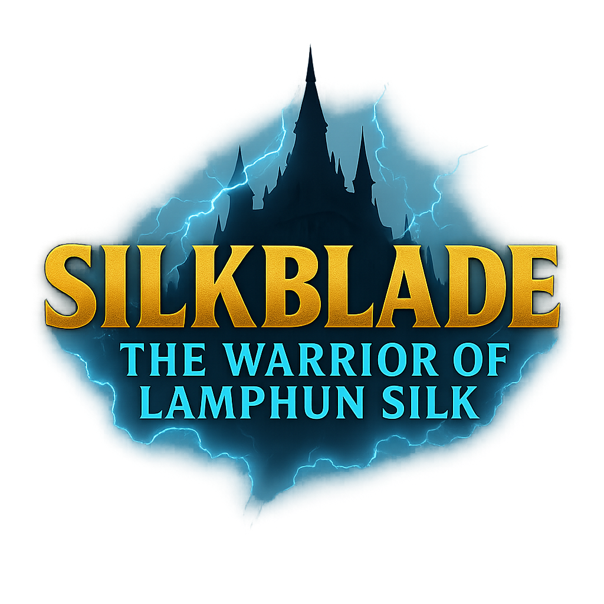

# SilkBlade

<p align="center">
  
  <br>
  <em>A turn-based bullet-hell RPG built with LibGDX</em>
</p>

<p align="center">
  <a href="#overview">Overview</a> •
  <a href="#documentation">Documentation</a> •
  <a href="#features">Features</a> •
  <a href="#getting-started">Getting Started</a> •
  <a href="#controls">Controls</a> •
  <a href="#screenshots">Screenshots</a> •
  <a href="#contributing">Contributing</a> •
  <a href="#license">License</a>
</p>

## Overview

SilkBlade is a turn-based bullet-hell RPG that combines traditional RPG elements with action-based combat. Set in a world influenced by Thai silk weaving culture, players navigate through stages of increasing difficulty, facing unique enemies and challenging boss encounters.

The game mechanics blend strategic turn-based decision making with real-time bullet dodging, creating a unique hybrid gameplay experience.

## Documentation

Comprehensive documentation is available to understand the project structure and implementation:

- [**Game Overview**](SilkBlade_Overview.md) - High-level description of game concepts and systems
- [**Technical Documentation**](SilkBlade_Documentation.md) - Detailed explanation of code architecture and implementation
- [**Class Diagram**](SilkBlade_Class_Diagram.md) - Visual representation of class relationships and structure

## Features

- **Unique Combat System**: Turn-based strategy combined with bullet-hell action
- **Rich Progression**: Level up system with 20 player levels and stat growth
- **Skill System**: 7 unique skills with different effects and mechanics
- **Enemy Variety**: Multiple enemy types with distinct visual styles and attack patterns
- **Boss Encounters**: 5 challenging bosses at milestone stages
- **Item System**: Equipment and consumables to enhance player abilities
- **Stage Progression**: 50 stages of increasing difficulty
- **Save System**: Comprehensive save/load functionality

## Getting Started

### Requirements
- Java 8 or higher
- OpenGL-compatible graphics card
- 512MB RAM minimum
- 100MB disk space

### Installation

#### Option 1: Download Release
1. Download the latest release from the [Releases page](https://github.com/username/silkblade/releases)
2. Extract the ZIP archive
3. Run `silkblade.jar` or the platform-specific executable

#### Option 2: Build from Source
1. Clone the repository:
   ```bash
   git clone https://github.com/username/silkblade.git
   ```
2. Navigate to the project directory:
   ```bash
   cd silkblade
   ```
3. Build with Gradle:
   ```bash
   ./gradlew build
   ```
4. Run the desktop version:
   ```bash
   ./gradlew desktop:run
   ```

## Controls

- **WASD or Arrow Keys**: Move player during combat
- **Z or Enter**: Confirm selection
- **X or Escape**: Cancel/Back
- **Space**: Skip dialogue
- **Tab**: Quick access to inventory during exploration

## Screenshots

<p align="center">
  
  
  <br>
  
  
</p>

## Contributing

We welcome contributions to SilkBlade! Please see our [contribution guidelines](CONTRIBUTING.md) for details on how to get started.

### Development Setup
1. Fork the repository
2. Create a feature branch: `git checkout -b feature/amazing-feature`
3. Commit your changes: `git commit -m 'Add some amazing feature'`
4. Push to the branch: `git push origin feature/amazing-feature`
5. Open a Pull Request

### Code Style
- Follow Java naming conventions
- Add JavaDoc comments for public methods
- Maintain the existing architecture patterns
- Write unit tests for new features

## License

This project is licensed under the MIT License - see the [LICENSE](LICENSE) file for details.

## Acknowledgments

- LibGDX framework and community
- All contributors who have helped shape this project
- Inspiration from both bullet-hell games and traditional RPGs 
