# SilkBlade Class Diagram

## Table of Contents
- [Class Diagram](#class-diagram)
- [Key Relationships](#key-relationships)
- [Core Classes and Interfaces](#core-classes-and-interfaces)
- [Implementation Details](#implementation-details)

## Class Diagram

The following diagram illustrates the key classes and their relationships in the SilkBlade codebase:

```mermaid
classDiagram
    %% Core Game Classes
    Game <|-- Main
    Main --> ScreenManager
    Main --> ItemDatabase
    
    %% Screen Management
    ScreenManager --> Screen
    Screen <|-- MainMenuScreen
    Screen <|-- CombatScene
    Screen <|-- InventoryScreen
    Screen <|-- ShopScreen
    Screen <|-- StageSelectionScreen
    Screen <|-- SaveFileSelectionScreen
    Screen <|-- CharacterCreationScreen
    Screen <|-- OptionsScreen
    Screen <|-- GameOverScreen
    Screen <|-- CreditsScreen
    Screen <|-- MainNavigationScreen
    
    %% Screen classes with their key properties
    class ScreenManager {
        -currentScreen Screen
        +setCurrentScreen(Screen) void
        +getCurrentScreen() Screen
    }
    
    class MainMenuScreen {
        -game Game
        -viewport FitViewport
        -camera OrthographicCamera
        -batch SpriteBatch
        -font BitmapFont
        -titleTexture Texture
        -selectSound Sound
        -selectedIndex int
        -inputEnabled boolean
        +render(float) void
        +handleInput() void
        +processMenuSelection(int) void
    }
    
    class CombatScene {
        -player Player
        -currentEnemy Enemy
        -bullets Array~Bullet~
        -playerTurn boolean
        -enemyTurn boolean
        -inCombat boolean
        -batch SpriteBatch
        -font BitmapFont
        -background Texture
        -camera OrthographicCamera
        -viewport FitViewport
        -soundEffect Sound
        +startCombat() void
        +spawnBullet() void
        +updateBullets(float) void
        +handleCollisions() void
        +render(float) void
    }
    
    %% Entity System - Enemies
    class Enemy {
        <<interface>>
        +getName() String
        +getMaxHP() int
        +getCurrentHP() int
        +setHP(int) void
        +damage(int, boolean) void
        +isDefeated() boolean
        +getTexture() Texture
        +getWidth() float
        +getHeight() float
        +draw(SpriteBatch, float, float) void
        +update(float) void
        +generateAttack(float, float, float, float) List~Bullet~
        +getAttackDamage() int
        +getAttackInterval() float
        +getArenaWidth() float
        +getArenaHeight() float
        +getCurrentPattern() EnemyAttackPattern
        +isTurnActive() boolean
        +startTurn() void
        +endTurn() void
        +getEncounterDialogue() String
        +getAttackDialogue() String
        +getDefeatDialogue() String
        +getVictoryDialogue() String
        +getExpReward() int
        +getGoldReward() int
        +updatePlayerPosition(float, float) void
    }
    
    class AbstractEnemy {
        #name String
        #maxHP int
        #currentHP int
        #texture Texture
        #width float
        #height float
        #turnActive boolean
        #primaryColor Color
        #arenaWidth float
        #arenaHeight float
        #attackInterval float
        #maxBullets int
        #attackDamage int
        #patternManager EnemyAttackPatternManager
        #currentPattern EnemyAttackPattern
        +scaleToPlayerLevel(int) void
        +damage(int, boolean) void
        +generateAttack(float, float, float, float) List~Bullet~
        #onBulletsSpawned() void
    }
    
    Enemy <|.. AbstractEnemy
    AbstractEnemy <|-- SilkCicada
    AbstractEnemy <|-- SilkWeaver
    AbstractEnemy <|-- SilkWraith
    AbstractEnemy <|-- SilkGuardian
    AbstractEnemy <|-- SilkRevenant
    AbstractEnemy <|-- GoldenCocoon
    AbstractEnemy <|-- SpiritOfTheLoom
    AbstractEnemy <|-- Threadmancer
    AbstractEnemy <|-- CrimsonSericulture
    AbstractEnemy <|-- HundredSilkOgre
    
    %% Player System
    class Player {
        -name String
        -level int
        -exp int
        -maxHP int
        -currentHP int
        -maxMP int
        -mp int
        -attack int
        -defense int
        -critRate float
        -unlockedSkills boolean[]
        -currentSkill SkillType
        -inventory Inventory
        -buffManager BuffManager
        -currentStage int
        -gold int
        +gainExp(int) boolean
        +levelUp() void
        +takeDamage(int) void
        +heal(int) void
        +useItem(Item) boolean
        +saveToFile() void
        +loadFromFile() Player
        +isSkillUnlocked(SkillType) boolean
        +unlockSkill(SkillType) void
        +getSkillMPCost(SkillType) int
        +createSnapshot() Player
        +restoreFromSnapshot(Player) void
    }
    
    class SkillType {
        <<enumeration>>
        BASIC
        SKILL1
        SKILL2
        SKILL3
        SKILL4
        SKILL5
        SKILL6
        +getDisplayName() String
    }
    
    %% Attack Pattern System
    class EnemyAttackPattern {
        <<interface>>
        +generateBullets(Enemy, float, float, float, float) List~Bullet~
        +getPatternName() String
        +getConfig() AttackPatternConfig
    }
    
    class AttackPatternConfig {
        -minDamage int
        -maxDamage int
        -patternDuration float
        -bulletSpeed float
        -maxBullets int
        -arenaWidth float
        -arenaHeight float
        -bulletColor Color
        -usesCustomColors boolean
        -patternName String
        -bulletSize float
        -attackInterval float
        +getAttackInterval() float
        +getArenaWidth() float
        +getArenaHeight() float
    }
    
    class EnemyAttackPatternManager {
        -patterns List~EnemyAttackPattern~
        +addPattern(EnemyAttackPattern) void
        +selectRandomPattern() EnemyAttackPattern
    }
    
    EnemyAttackPattern --> AttackPatternConfig
    EnemyAttackPatternManager --> EnemyAttackPattern
    AbstractEnemy --> EnemyAttackPatternManager
    
    %% Combat System
    class Bullet {
        -damage float
        -x float
        -y float
        -velocityX float
        -velocityY float
        -size float
        -color Color
        -isHealing boolean
        +update(float) void
        +render(SpriteBatch) void
        +getHitbox() Rectangle
    }
    
    %% Item System
    class Item {
        <<interface>>
        +getName() String
        +getDescription() String
        +getValue() int
        +use(Player) void
        +getTexture() Texture
    }
    
    class ConsumableItem {
        -name String
        -description String
        -value int
        -texture Texture
        -healAmount int
        -manaAmount int
        -quantity int
        +use(Player) void
        +increaseQuantity(int) boolean
        +decreaseQuantity(int) boolean
        +getQuantity() int
        +clone() ConsumableItem
    }
    
    class Equipment {
        -name String
        -description String
        -value int
        -texture Texture
        -type EquipmentType
        -statBonuses Map
        -percentBonuses Map
        -thornDamage float
        -hasDeathDefiance boolean
        -hasFreeSkillCast boolean
        +getType() EquipmentType
        +getStatBonus(StatType) int
        +getPercentBonus(StatType) float
        +getThornDamage() float
        +hasDeathDefiance() boolean
        +hasFreeSkillCast() boolean
    }
    
    class ItemDatabase {
        -instance ItemDatabase
        -equipmentDatabase ObjectMap~String,Equipment~
        -consumableDatabase ObjectMap~String,ConsumableItem~
        +getInstance() ItemDatabase
        +getEquipmentById(String) Equipment
        +getConsumableById(String) ConsumableItem
        +getAllEquipment() Array~Equipment~
        +getAllConsumables() Array~ConsumableItem~
    }
    
    class Inventory {
        -equippedItems Array~Equipment~
        -inventoryItems Array~Equipment~
        -storageItems Array~Equipment~
        -consumableItems Array~ConsumableItem~
        -combatItems Array~ConsumableItem~
        +equipItem(Equipment) Equipment
        +unequipItem(EquipmentType) boolean
        +addToInventory(Equipment) boolean
        +addConsumableItem(ConsumableItem) boolean
        +useConsumableItem(ConsumableItem) boolean
        +getTotalAttackBonus() int
        +getTotalDefenseBonus() int
        +getTotalHPBonus() int
        +getTotalMPBonus() int
        +getTotalCritBonus() float
        +getTotalThornDamage() float
        +hasDeathDefiance() boolean
        +hasFreeSkillCast() boolean
    }
    
    class EquipmentType {
        <<enumeration>>
        WEAPON
        ARMOR
        ACCESSORY
    }
    
    Item <|.. ConsumableItem
    Item <|.. Equipment
    ItemDatabase --> Item
    Player --> Inventory
    Player --> SkillType
    Inventory --> Item
    Inventory --> EquipmentType
    Equipment --> EquipmentType
    
    %% Buff System
    class BuffManager {
        -player Player
        -activeBuffs Array~StatBuff~
        +addBuff(StatType, int, int) void
        +updateBuffs(float) void
        +getAttackBuff() int
        +getDefenseBuff() int
        +getCritRateBuff() float
        +getActiveBuffs() Array~StatBuff~
    }
    
    class StatType {
        <<enumeration>>
        ATTACK
        DEFENSE
        HP
        MP
        CRIT_RATE
    }
    
    class StatBuff {
        -type StatType
        -amount int
        -remainingTurns int
        +getType() StatType
        +getAmount() int
        +getRemainingTurns() int
    }
    
    BuffManager --> StatType
    BuffManager --> StatBuff
    Player --> BuffManager
    
    %% Display connections
    CombatScene --> Player
    CombatScene --> Enemy
    CombatScene --> Bullet
```



## Key Relationships

### 1. Main Game System
- `Main` extends LibGDX's `Game` class, providing the entry point
- `Main` initializes core systems and manages screen transitions
- Central resource management (camera, viewport, audio) is handled here

### 2. Screen Management
- Various screens extend LibGDX's `Screen` interface
- `ScreenManager` handles navigation between screens
- Each screen type handles a specific game state (menus, combat, inventory)

### 3. Entity System
- `Enemy` interface defines the contract for enemy entities
- `AbstractEnemy` provides common implementation for all enemies
- Concrete enemy classes implement specific behaviors and visuals
- `Player` class manages player state, progression, and abilities
- Both player and enemies participate in the combat system

### 4. Combat System
- `CombatScene` orchestrates bullet-hell gameplay
- `Bullet` represents projectiles in combat with position, velocity, and damage
- Enemy attack patterns determine bullet behavior and formations
- Combat flow is managed through state transitions (playerTurn, enemyTurn)

### 5. Pattern System
- `EnemyAttackPattern` defines attack behaviors through the generation of bullets
- `AttackPatternConfig` provides configuration for attack patterns
- `EnemyAttackPatternManager` manages patterns for enemies
- Patterns determine difficulty and visual style of combat encounters

### 6. Item System
- `Item` interface defines the contract for all items
- `ConsumableItem` implements single-use items with effects
- `Equipment` implements permanent stat-boosting items
- `ItemDatabase` provides centralized item management
- `Inventory` handles the player's collection of items

## Core Classes and Interfaces

### Main.java
The entry point for the application that extends LibGDX's Game class:
```java
public class Main extends Game {
    private static OrthographicCamera camera;
    private static FitViewport viewport;
    private static Music backgroundMusic;
    
    @Override
    public void create() {
        // Initialize core systems
        initializeGraphics();
        initializeItemDatabase();
        initializeAudio();
        setScreen(new MainMenuScreen(this));
    }
    
    // Additional lifecycle and utility methods
}
```

### Enemy.java
Interface defining the contract for all enemy entities:
```java
public interface Enemy {
    String getName();
    int getMaxHP();
    int getCurrentHP();
    void setHP(int hp);
    void damage(int amount, boolean isCritical);
    boolean isDefeated();
    
    Texture getTexture();
    float getWidth();
    float getHeight();
    void draw(SpriteBatch batch, float x, float y);
    
    List<Bullet> generateAttack(float arenaX, float arenaY, float arenaWidth, float arenaHeight);
    EnemyAttackPattern getCurrentPattern();
    
    String getEncounterDialogue();
    String getAttackDialogue();
    String getDefeatDialogue();
    
    int getExpReward();
    int getGoldReward();
}
```

### Player.java
Class managing the player character with progression, stats, and skills:
```java
public class Player implements Json.Serializable {
    // Level and progression
    private int level;
    private int exp;
    
    // Core stats
    private int maxHP;
    private int currentHP;
    private int maxMP;
    private int mp;
    private int attack;
    private int defense;
    private float critRate;
    
    // Skills system
    private boolean[] unlockedSkills;
    private SkillType currentSkill;
    
    // Inventory and equipment
    private Inventory inventory;
    
    // Methods for leveling, combat, and state management
    public boolean gainExp(int amount) { /* ... */ }
    public DamageResult calculateDamage() { /* ... */ }
    public void takeDamage(int damage) { /* ... */ }
    public void heal(int amount) { /* ... */ }
    
    // Skill system methods
    public boolean isSkillUnlocked(SkillType skill) { /* ... */ }
    public void unlockSkill(SkillType skill) { /* ... */ }
    public DamageResult calculateSkillDamage(SkillType skill) { /* ... */ }
    
    // Save/load functionality
    public void saveToFile() { /* ... */ }
    public static Player loadFromFile() { /* ... */ }
}
```

### CombatScene.java
The core gameplay screen handling combat mechanics:
```java
public class CombatScene implements Screen {
    // Core components
    private Player player;
    private Enemy currentEnemy;
    private Array<Bullet> bullets;
    
    // State management
    private boolean playerTurn;
    private boolean enemyTurn;
    private boolean inCombat;
    
    // Core methods
    public void startCombat() { /* ... */ }
    private void updateBullets(float delta) { /* ... */ }
    private void handleCollisions() { /* ... */ }
    private void renderBullets() { /* ... */ }
    
    // Screen implementation
    @Override
    public void render(float delta) { /* ... */ }
    @Override
    public void dispose() { /* ... */ }
}
```

## Implementation Details

### Enemy Creation
Enemies are created with specific properties and attack patterns:

```java
public SilkCicada(int stage) {
    super("Silk Cicada", BASE_HP,
          new Texture(Gdx.files.internal("enemy/baseCicada.png")),
          300f, 300f);
    
    // Configure based on stage range
    if (stage >= 27 && stage <= 29) {
        // High difficulty (red tint)
        this.addAttackPattern(new HighAttackPattern());
        this.primaryColor = new Color(1.0f, 0.3f, 0.3f, 1.0f);
        this.name = "Crimson Silk Cicada";
    } else if (stage >= 24 && stage <= 26) {
        // Medium difficulty (green tint)
        this.addAttackPattern(new MediumAttackPattern());
        this.primaryColor = new Color(0.3f, 1.0f, 0.5f, 1.0f);
        this.name = "Emerald Silk Cicada";
    } else {
        // Low difficulty (no tint)
        this.addAttackPattern(new LowAttackPattern());
        this.primaryColor = Color.WHITE;
    }
    
    // Initialize dialogues and other properties
}
```

### Attack Pattern Generation
Patterns generate bullets based on enemy state and configuration:

```java
@Override
public List<Bullet> generateBullets(Enemy enemy, float arenaX, float arenaY,
                                float arenaWidth, float arenaHeight) {
    List<Bullet> bullets = new ArrayList<>();
    
    // Update timers
    float delta = Gdx.graphics.getDeltaTime();
    phaseTimer += delta;
    
    // Execute current phase
    switch (currentPhase) {
        case 0:
            // Phase 1: Grid pattern
            createGridPattern(bullets, enemyX, enemyY, playerX, playerY,
                             baseSpeed, minDamage, maxDamage, enemyColor);
            currentPhase++;
            break;
        // Additional phases...
    }
    
    return bullets;
}
```

### Player Progression
The leveling system handles stat growth and skill unlocks:

```java
public boolean gainExp(int amount) {
    if (level >= MAX_LEVEL) {
        return false;
    }

    int oldLevel = level;
    exp += amount;

    // Check for level up
    while (level < MAX_LEVEL && exp >= getExpToNextLevel()) {
        level++;
        
        // Stat increases with scaling formulas
        maxHP += 5 + (int)(level * 1.2f);
        currentHP = maxHP;  // Full heal on level up
        attack += 2 + (int)(level * 1.05f);
        maxMP += 3 + (int)(level * 1.087f);
        defense += 1 + (int)(level * 0.4f);
        critRate = Math.min(0.1f + (level * 0.008f), 0.35f);
        
        // Check for skill unlocks
        checkSkillUnlocks();
    }
    
    return level > oldLevel;
}
``` 