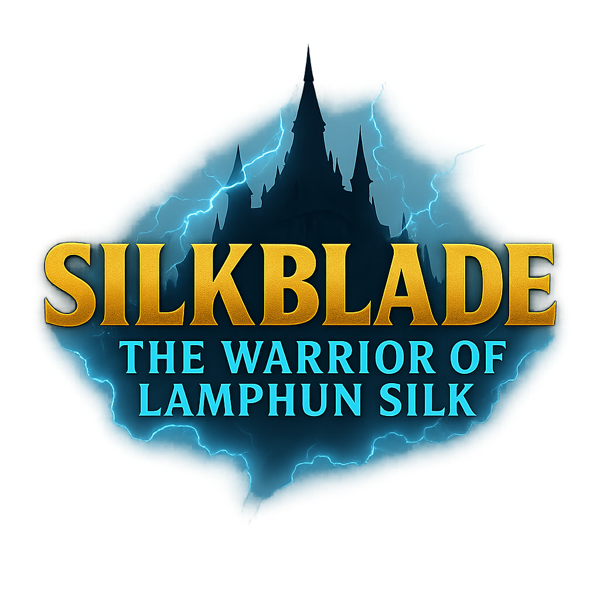
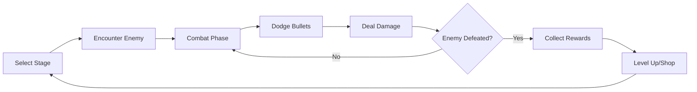

# SilkBlade Game Overview



## Table of Contents
- [Game Concept](#game-concept)
- [Core Gameplay Loop](#core-gameplay-loop)
- [Key Game Systems](#key-game-systems)
  - [Combat System](#combat-system)
  - [Character Progression](#character-progression)
  - [Skill System](#skill-system)
  - [Item and Equipment System](#item-and-equipment-system)
  - [Stage Progression](#stage-progression)
- [Technical Architecture](#technical-architecture)
  - [Core Systems](#core-systems)
  - [Enemy Design](#enemy-design)
  - [Pattern Design](#pattern-design)
- [Art and Audio](#art-and-audio)
- [Save and Load System](#save-and-load-system)
- [Running the Game](#running-the-game)
- [Contribution Guidelines](#contribution-guidelines)

## Game Concept
SilkBlade is a turn-based bullet-hell RPG built with [LibGDX](https://libgdx.com/), a Java game development framework. The game combines traditional RPG elements like character progression, equipment, and skills with action-based combat where players must navigate through intricate bullet patterns.

The game is set in a world influenced by Thai silk weaving culture, with enemies and skills themed around silk, weaving, and local cultural elements. The narrative follows a protagonist's journey through increasingly challenging areas to defeat five legendary silk entities.

**Game Features:**
- Turn-based combat with real-time bullet-dodging mechanics
- Rich progression system with 20 player levels
- 7 unique skills with distinctive effects and animations
- Multiple enemy types with different attack patterns
- 5 challenging boss encounters that unlock new abilities
- Equipment and item systems that modify player stats
- Immersive sound effects and music that adapt to game context

## Core Gameplay Loop



1. **Stage Selection**: Players select stages from the StageSelectionScreen, with difficulty increasing as they progress.
2. **Combat Encounter**: Each stage features enemies with unique attack patterns. Combat is initiated through the CombatScene class.
3. **Tactical Decision**: Players choose from four actions:
   - **FIGHT**: Enter bullet-hell mode to dodge enemy attacks
   - **SKILL**: Use special abilities that consume MP
   - **ITEM**: Use consumable items for various effects
   - **RUN**: Attempt to escape combat (success rate depends on enemy type)
4. **Bullet-Hell Phase**: During the FIGHT or after using a SKILL, enemies spawn bullet patterns that the player must dodge. The pattern complexity increases with stage level.
5. **Damage Calculation**: Successfully dodging leads to dealing damage to the enemy based on player stats and skills used.
6. **Rewards**: Defeating enemies grants experience points (scaled by enemy level) and gold for purchasing items in the shop.
7. **Progression**: Players level up, unlock new skills, and can purchase items between combat encounters.
8. **Boss Encounters**: At milestone stages (10, 20, 30, 40, and 50), players face bosses that unlock new skills upon defeat.

## Key Game Systems

### Combat System
SilkBlade's combat is implemented in the `CombatScene` class (~4000 lines), making it the most complex part of the game:

```java
// Combat phase initialization
public void startCombat() {
    playerTurn = false;
    enemyTurn = true;
    inCombat = true;
    combatStartGraceTimer = COMBAT_START_GRACE_PERIOD;
    // Setup arena and enemy positions
    centerArena();
    updateArenaForPattern();
    // Initialize player position at center of arena
    playerX = arena.x + arena.width / 2;
    playerY = arena.y + arena.height / 2;
}
```

- **Bullet-Hell Mechanics**: 
  - Bullets are generated through enemy attack patterns
  - Each bullet has properties like position, velocity, size, color, and damage
  - Bullet collisions are detected using Rectangle hitboxes
  - Visual telegraphing shows where bullets will appear
  - Trails behind bullets help with visual tracking

- **Turn-Based Structure**: 
  - Turn flow is managed by state flags (`playerTurn`, `enemyTurn`, `inCombat`)
  - Combat phases include dialogue, action selection, bullet dodging, and result calculation
  - Arena size dynamically adjusts based on enemy attack patterns

- **Damage System**: 
  - Damage calculation includes base damage, critical hits, and skill modifiers
  - Player stats (attack, defense) affect damage dealt and received
  - Damage numbers appear with animations (upward floating movement)
  - Hit effects include screen shake, sound effects, and visual flashes

- **Death Defiance**: 
  - Activates when player would be defeated
  - Provides temporary invincibility with rainbow visual effect
  - Duration: 5 seconds
  - Limited to once per combat encounter

### Character Progression
Character progression is managed by the `Player` class:

```java
// Experience table and level caps
private static final int[] EXP_REQUIREMENTS = {
    0,      // LV 1:   0 EXP
    10,     // LV 2:  10 EXP
    30,     // LV 3:  30 EXP
    /* ... */
    99999   // LV 20: 99999 EXP
};

// Leveling logic
public boolean gainExp(int amount) {
    if (level >= MAX_LEVEL) {
        return false;
    }

    int oldLevel = level;
    exp += amount;

    // Check for level up
    while (level < MAX_LEVEL && exp >= getExpToNextLevel()) {
        level++;
        
        // Stat increases with specialized scaling formulas
        maxHP += 5 + (int)(level * 1.2f);  
        currentHP = maxHP;  // Full heal on level up
        attack += 2 + (int)(level * 1.05f);
        maxMP += 3 + (int)(level * 1.087f);
        defense += 1 + (int)(level * 0.4f);
        critRate = Math.min(0.1f + (level * 0.008f), 0.35f);
        
        // Check for skill unlocks
        checkSkillUnlocks();
    }
    
    return level > oldLevel;
}
```

- **Level System**: 
  - Maximum level: 20
  - Exponential XP curve (10 XP for level 2, 99,999 XP for level 20)
  - Enemies provide scaled XP based on their level and type
  - Boss encounters provide significant XP boosts

- **Stat System**:
  - **Health Points (HP)**: Determines survival capacity (scales by 5 + level*1.2 per level)
  - **Mana Points (MP)**: Resource for using skills (scales by 3 + level*1.087 per level)
  - **Attack**: Determines damage output (scales by 2 + level*1.05 per level)
  - **Defense**: Reduces incoming damage (scales by 1 + level*0.4 per level)
  - **Critical Rate**: Chance for critical hits (scales by 0.008 per level, capped at 35%)

- **Buff System**:
  - Temporary stat enhancements from items or skills
  - Managed by the `BuffManager` class
  - Buff types include Attack, Defense, and Critical Rate
  - Visual indicators show active buffs with remaining duration

### Skill System
The skill system provides special abilities through the `SkillType` enum and methods in the `Player` class:

```java
public enum SkillType {
    BASIC("Slash"),  // Always available
    SKILL1("Dark Silk Face Slap"),
    SKILL2("Silk Scratch of Salvation"),
    SKILL3("Duckfoot Knot from Heaven"),
    SKILL4("Sai-Oua Silk Wrap"),
    SKILL5("Lamphun Blade: Piip Slash Supreme"),
    SKILL6("Silk End - I Am Cosmic Weave");
    
    private final String displayName;
    
    // Constructor and methods...
}

// MP costs for skills
private static final int[] SKILL_MP_COSTS = {
    0,    // BASIC:  0 MP
    15,   // SKILL1: 15 MP
    25,   // SKILL2: 25 MP
    30,   // SKILL3: 30 MP
    35,   // SKILL4: 35 MP
    50,   // SKILL5: 50 MP
    -1    // SKILL6: special case - uses all MP
};
```

- **Skill Unlock Conditions**:
  - **Dark Silk Face Slap**: Unlocked at stage 10
  - **Silk Scratch of Salvation**: Unlocked after defeating the 30th floor boss
  - **Duckfoot Knot from Heaven**: Unlocked at player level 12
  - **Sai-Oua Silk Wrap**: Unlocked after defeating the 20th floor boss
  - **Lamphun Blade: Piip Slash Supreme**: Unlocked after defeating the 40th floor boss
  - **Silk End - I Am Cosmic Weave**: Unlocked after defeating Boss 5 (ultimate skill)

- **Skill Effects**:
  - **Basic Slash**: Standard attack with no MP cost
  - **Dark Silk Face Slap**: Medium damage with chance for critical hit
  - **Silk Scratch of Salvation**: Multiple hits with cumulative damage
  - **Duckfoot Knot from Heaven**: High damage with defense penetration
  - **Sai-Oua Silk Wrap**: Damage with temporary defense buff
  - **Lamphun Blade: Piip Slash Supreme**: Massive damage with critical hit guarantee
  - **Silk End - I Am Cosmic Weave**: Ultimate skill that uses all MP for devastation

- **Skill Implementation**:
  - Damage calculation based on player stats and skill-specific modifiers
  - Custom sound effects and visual effects for each skill
  - MP consumption with validation checks
  - Special case handling for the ultimate skill

### Item and Equipment System

The inventory system is implemented through the `Inventory` class and various item types:

```java
public class Inventory {
    private List<Item> items;
    private Map<Equipment.Slot, Equipment> equippedItems;
    
    // Methods to manage inventory and equipment
}

// Equipment slot types
public enum Slot {
    WEAPON,
    ARMOR,
    ACCESSORY
}
```

- **Item Categories**:
  - **Consumables**: Single-use items with immediate effects
    - Health potions (Small, Medium, Large): Restore different amounts of HP
    - Mana potions (Small, Medium, Large): Restore different amounts of MP
    - Stat boosters: Temporarily increase Attack, Defense, or Critical Rate
    - Special items: Unique effects like full restoration or Death Defiance reset
  
  - **Equipment**: Permanent stat modifiers when equipped
    - **Weapons**: Primary Attack boost with secondary stats
      - Examples: Silk Dagger (+5 Attack), Ceremonial Blade (+12 Attack, +5% Crit)
    - **Armor**: Primary Defense boost with secondary stats
      - Examples: Silk Garb (+5 Defense), Royal Weave (+15 Defense, +20 Max HP)
    - **Accessories**: Special effects and stat combinations
      - Examples: Lucky Charm (+5% Crit), Silk Emblem (+5% all stats)

- **Shop System**:
  - Available items rotate based on player progression
  - Gold economy balanced to require strategic purchases
  - Special rare items appear after specific milestones

- **Equipment Implementation**:
  - Equipment slots limit what can be equipped simultaneously
  - Equipping new items automatically unequips items in the same slot
  - Stats are calculated dynamically including all equipment bonuses

### Stage Progression
The stage system controls game difficulty and progression:

```java
// Player stage tracking
private int currentStage = 1; // Default to stage 1

// Setting stage unlocks skills and adjusts difficulty
public void setCurrentStage(int currentStage) {
    this.currentStage = currentStage;
    // Check if this stage change should unlock any skills
    checkStageUnlocks();
    // Save player data after updating stage
    saveToFile();
}
```

- **Stage Structure**:
  - 50 total stages with increasing difficulty
  - Stages 1-9: Tutorial and early game
  - Stages 10-19: Mid game (after first boss)
  - Stages 20-29: Advanced difficulty
  - Stages 30-39: Expert difficulty
  - Stages 40-49: Master difficulty
  - Stage 50: Final boss

- **Enemy Scaling**:
  - Enemy stats scale based on stage number and player level
  - New enemy types are introduced at stage thresholds
  - Higher stages feature more complex bullet patterns
  - Enemy visual appearance changes at certain stage ranges (e.g., SilkCicada color variants)

- **Boss Encounters**:
  - Stage 10: First boss (SilkGuardian)
  - Stage 20: Second boss (GoldenCocoon)
  - Stage 30: Third boss (SpiritOfTheLoom)
  - Stage 40: Fourth boss (Threadmancer)
  - Stage 50: Final boss (CrimsonSericulture)

## Technical Architecture

### Core Systems

- **Main Game Class** (`Main.java`):
  ```java
  public class Main extends Game {
      // Core components
      private static OrthographicCamera camera;
      private static FitViewport viewport;
      private static Music backgroundMusic;
      
      @Override
      public void create() {
          // Initialize systems and set initial screen
          initializeGraphics();
          initializeItemDatabase();
          initializeAudio();
          setScreen(new MainMenuScreen(this));
      }
      
      // Resource management and other methods...
  }
  ```
  - Entry point for the application
  - Manages global resources like camera, viewport, and audio
  - Handles screen transitions
  - Provides static access to core game components

- **Screen System**:
  ```java
  public class ScreenManager {
      private static Screen currentScreen;
      private static Screen previousScreen;
      
      public static void setScreen(Screen screen) {
          previousScreen = currentScreen;
          currentScreen = screen;
          Main.getGame().setScreen(screen);
      }
      
      public static void goBack() {
          // Return to previous screen with proper cleanup
      }
  }
  ```
  - Implements various game screens through LibGDX's Screen interface
  - Manages transitions between screens
  - Maintains screen state and history for navigation

- **Entity System**:
  - Hierarchical structure for game objects
  - Base interfaces define common behaviors
  - Abstract classes provide shared implementation
  - Concrete classes implement specific functionality

- **Pattern System**:
  ```java
  public interface EnemyAttackPattern {
      List<Bullet> generateBullets(Enemy enemy, float arenaX, float arenaY,
                                float arenaWidth, float arenaHeight);
      String getPatternName();
      AttackPatternConfig getConfig();
  }
  ```
  - Modular design for enemy attack behaviors
  - Configuration-driven pattern definition
  - Phase-based patterns with timing controls

### Enemy Design

Enemies are implemented with a robust class hierarchy:

```java
// Base interface defines contract
public interface Enemy {
    // Core properties and methods
    String getName();
    int getMaxHP();
    int getCurrentHP();
    void setHP(int hp);
    void damage(int amount, boolean isCritical);
    // Visual properties
    Texture getTexture();
    void draw(SpriteBatch batch, float x, float y);
    // Combat methods
    List<Bullet> generateAttack(float arenaX, float arenaY, float arenaWidth, float arenaHeight);
    // ... other methods
}

// Abstract base class provides common implementation
public abstract class AbstractEnemy implements Enemy {
    // Shared fields and implementation
    protected String name;
    protected int maxHP;
    protected int currentHP;
    protected Texture texture;
    // Combat properties
    protected float arenaWidth;
    protected float arenaHeight;
    protected float attackInterval;
    protected int maxBullets;
    protected int attackDamage;
    // Pattern management
    protected EnemyAttackPatternManager patternManager;
    protected EnemyAttackPattern currentPattern;
    
    // Common methods with shared logic
    public void scaleToPlayerLevel(int playerLevel) {
        // Scaling formulas...
    }
    
    // Other shared implementation...
}
```

- **Enemy Types**:
  - **Regular Enemies**: 
    - SilkWeaver: Basic enemy for early stages
    - SilkWraith: Fast-moving ghost-like enemy
    - SilkGuardian: Mini-boss with defensive patterns
    - SilkRevenant: Enemy with resurrection capability
    - SilkCicada: Mid-game enemy with color variants
    - GoldenCocoon: Defensive enemy with barrier patterns
  
  - **Boss Enemies**:
    - SpiritOfTheLoom: Third boss with ethereal patterns
    - Threadmancer: Fourth boss with complex patterns
    - CrimsonSericulture: Final boss with multi-phase patterns
    - HundredSilkOgre: Special challenge boss

- **Enemy Implementation**:
  - Customizable properties including name, HP, textures, and size
  - Dialogue system for narrative integration
  - Dynamic difficulty scaling based on player level
  - Visual effects including color tints, shaking, and alpha transitions

### Pattern Design

Attack patterns follow a modular approach to create varied combat experiences:

```java
// Configuration for patterns
public class AttackPatternConfig {
    private final int minDamage;
    private final int maxDamage;
    private final float patternDuration;
    private final float bulletSpeed;
    private final int maxBullets;
    private final float arenaWidth;
    private final float arenaHeight;
    private final Color bulletColor;
    // Other configuration parameters...
}

// Example pattern implementation
public class MediumAttackPattern implements EnemyAttackPattern {
    private static final AttackPatternConfig CONFIG = new AttackPatternConfig(
        12, 15, 3.5f, 1.55f, 13, 380f, 330f, 
        new Color(0.3f, 0.7f, 0.1f, 1.0f), true,
        "Cicada's Rhythmic Pulse", 1.8f
    );
    
    // Pattern implementation...
    @Override
    public List<Bullet> generateBullets(Enemy enemy, float arenaX, float arenaY,
                                     float arenaWidth, float arenaHeight) {
        // Create bullets in specific formations...
    }
}
```

- **Pattern Categories**:
  - **Grid Patterns**: Bullets arranged in grid formation
  - **Wave Patterns**: Bullets moving in wave-like motions
  - **Spiral Patterns**: Bullets emerging in spiral formations
  - **Targeted Patterns**: Bullets that track player movement
  - **Random Patterns**: Bullets with randomized trajectories
  - **Combined Patterns**: Complex patterns using multiple techniques

- **Pattern Implementation Features**:
  - Phase-based pattern progression
  - Telegraphing for upcoming bullet spawns
  - Dynamic difficulty adjustments
  - Visual styling including colors and effects
  - Occasional healing bullets as risk/reward mechanic

## Art and Audio

The game uses sprites and sound effects to create an immersive experience:

- **Visual Assets**:
  - Character sprites with animation frames
  - Enemy sprites with color variations
  - Background art for different stages
  - UI elements for menus and combat
  - Special effect sprites for skills and hits
  - Particle effects for impacts and transitions

- **Audio System**:
  ```java
  // Audio volume control
  public static void setMusicVolume(float volume) {
      musicVolume = volume;
      if (backgroundMusic != null) {
          backgroundMusic.setVolume(musicVolume);
      }
  }
  
  // Play sound effects with volume control
  public static long playSound(Sound sound) {
      if (sound != null) {
          return sound.play(effectVolume);
      }
      return -1;
  }
  ```
  - Background music that changes based on context
  - Sound effects for actions, hits, and UI interactions
  - Volume controls for music and effects
  - Audio caching for performance

## Save and Load System

The game implements a comprehensive save system for player progression:

```java
// Save player data to JSON file
public void saveToFile() {
    try {
        Json json = new Json();
        json.setOutputType(JsonWriter.OutputType.json);
        FileHandle file = Gdx.files.local(SAVE_FILE);
        file.writeString(json.toJson(this), false);
    } catch (Exception e) {
        GameLogger.logError("Failed to save player data", e);
    }
}

// Load player data from JSON file
public static Player loadFromFile() {
    try {
        FileHandle file = Gdx.files.local(SAVE_FILE);
        if (file.exists()) {
            Json json = new Json();
            Player player = json.fromJson(Player.class, file);
            
            // Initialize transient fields
            player.initializeSprite();
            player.initializeSounds();
            player.buffManager = new BuffManager(player);
            
            return player;
        }
    } catch (Exception e) {
        GameLogger.logError("Failed to load player data", e);
    }
    return new Player();
}
```

- **Saved Data**:
  - Player stats (level, XP, HP, MP, attack, defense)
  - Inventory contents and equipped items
  - Unlocked skills and current progress
  - Completed stages and defeated bosses
  - Gold and other resources
  - Game settings and preferences

- **Save File Management**:
  - Save files are stored as JSON in the "save" directory
  - Multiple save slots for different playthroughs
  - Auto-save functionality after significant events
  - Save file selection screen for managing saves

## Running the Game

### Requirements
- Java 8 or higher
- OpenGL-compatible graphics card
- 512MB RAM (minimum)
- 100MB disk space

### Building from Source
1. Clone the repository: `git clone https://github.com/username/silkblade.git`
2. Navigate to the project directory: `cd silkblade`
3. Build with Gradle: `./gradlew build`
4. Run the desktop version: `./gradlew desktop:run`

### Controls
- **WASD or Arrow Keys**: Move player during combat
- **Z or Enter**: Confirm selection
- **X or Escape**: Cancel/Back
- **Space**: Skip dialogue
- **Tab**: Quick access to inventory during exploration

## Contribution Guidelines

### Development Setup
1. Fork the repository
2. Create a feature branch: `git checkout -b feature/amazing-feature`
3. Commit your changes: `git commit -m 'Add some amazing feature'`
4. Push to the branch: `git push origin feature/amazing-feature`
5. Open a Pull Request

### Coding Standards
- Follow Java naming conventions
- Add JavaDoc comments for public methods
- Maintain the existing architecture patterns
- Write unit tests for new features

### Asset Contributions
- Sprites should be PNG format with transparency
- Audio files should be MP3 (music) or WAV (sound effects)
- Include attribution information for all assets 